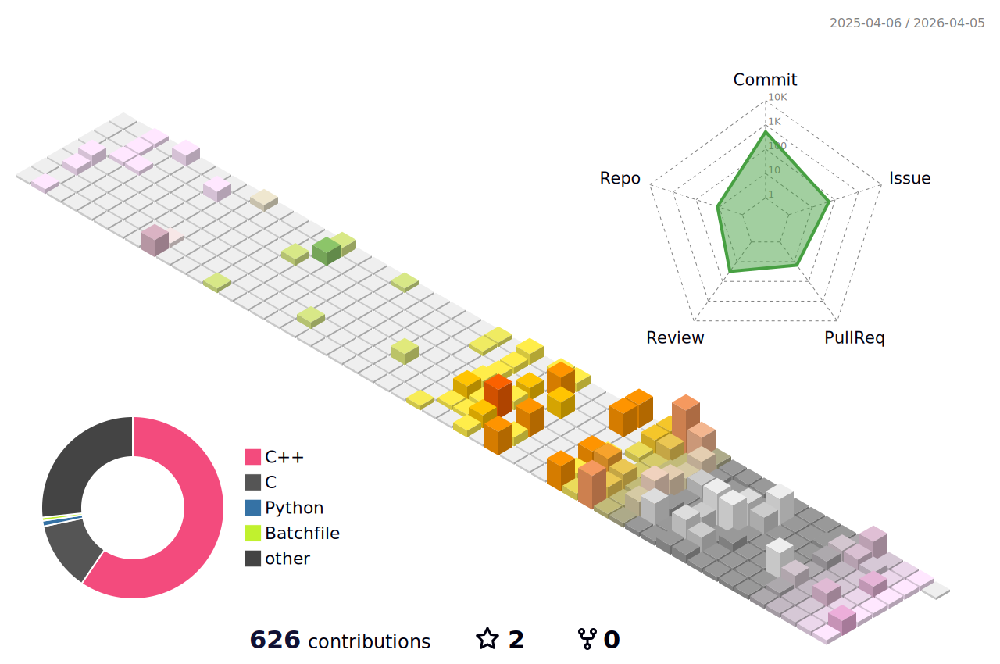
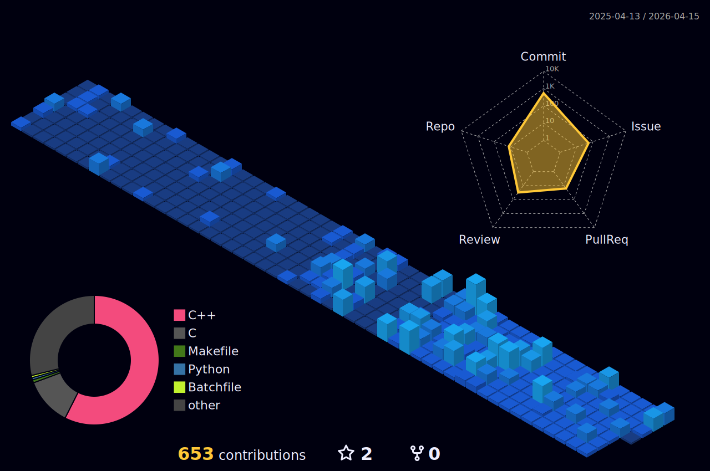
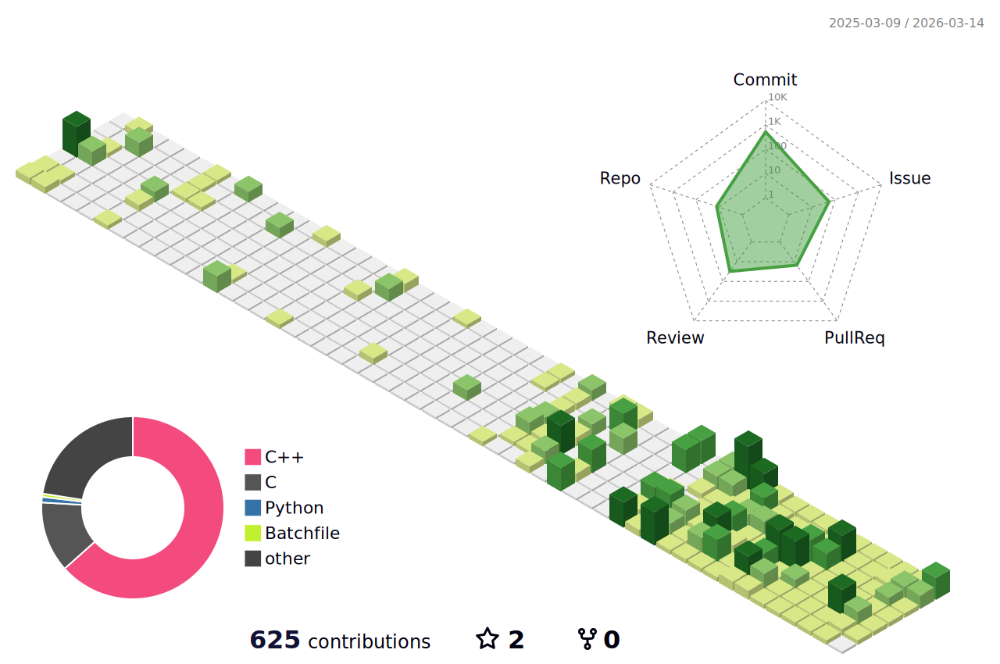

# YunoshinTani

  <em>
    Embedded / Low-level / C++ / Hardware-oriented development  
  </em>

---

## 📊 Contribution Activity (3D View)

<table>
  <tr>
    <td align="center">
      <picture>
        <source media="(prefers-color-scheme: dark)"
                srcset="profile-3d-contrib/profile-night-rainbow.svg" />
        <source media="(prefers-color-scheme: light)"
                srcset="profile-3d-contrib/profile-season-animate.svg" />
        
      </picture>
       
      Seasonal animated 3D contribution graph
    </td>
  </tr>
</table>

---

## 🌙 Theme Comparison

<table>
  <tr>
    <td align="center">
      <picture>
        <source media="(prefers-color-scheme: dark)"
                srcset="profile-3d-contrib/profile-night-view.svg" />
        
      </picture>
       
      Night View
    </td>
    <td align="center">
      <picture>
        <source media="(prefers-color-scheme: light)"
                srcset="profile-3d-contrib/profile-green.svg" />
        
      </picture>
       
      Green View
    </td>
  </tr>
</table>

---

## 📈 GitHub Metrics

  <picture>
    <source media="(prefers-color-scheme: dark)"  srcset="output/metrics.svg" />
    <source media="(prefers-color-scheme: light)" srcset="output/metrics.svg" />
    
  </picture>

  
    Commits / Issues / Pull Requests / Reviews overview
  

